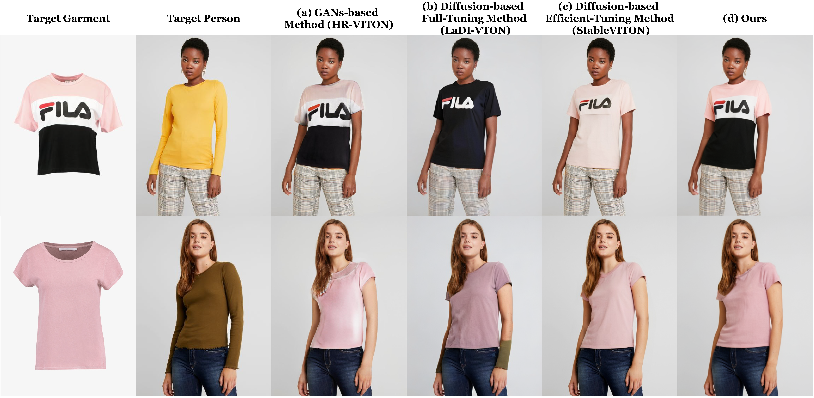

# TryOn-Adapter
This repository is the official implementation of [TryOn-Adapter](https://arxiv.org/abs/2404.00878)

> **TryOn-Adapter: Efficient Fine-Grained Clothing Identity Adaptation for High-Fidelity Virtual Try-On** 

>
> Jiazheng Xing, Chao Xu, Yijie Qian, Yang Liu, Guang Dai, Baigui Sun, Yong Liu, Jingdong Wang

[[arXiv Paper](https://arxiv.org/abs/2404.00878)]&nbsp;

&nbsp;

## TODO List
- [x] ~~Release Texture Highlighting Map and Segmentation Map~~
- [ ] Release Inference Code
- [ ]  Release model weights 
- [ ] Release Training Code

## Data Preparation
1. The VITON-HD dataset serves as a benchmark. Download [VITON-HD](https://github.com/shadow2496/VITON-HD) dataset.

2. In addition to above content, some other preprocessed conditions are in use in TryOn-Adapter.  The preprocessed data could be downloaded, respectively.

   |Content|Google|Baidu|
   |---|---|---|
   |Segmentation Map|[link](https://drive.google.com/file/d/18KvGWR-3siJ_mt7g4CcEVFi_51E7ZifA/view?usp=sharing)|[link](https://pan.baidu.com/s/1zm3XV34tcrXpYt6uAN4R9Q?pwd=ekyn)|
   |Highlighting Texture Map|[link](https://drive.google.com/file/d/111KBYA8-d9xl9a2aS9yUaTp0edflb7qT/view?usp=sharing)|[link](https://pan.baidu.com/s/1xWnvF7TeKB_2AzlCEbPsAQ?pwd=jnlz)|

3. Generate Warped Cloth and Warped Mask based on the [GP-VTON](https://github.com/xiezhy6/GP-VTON.git).

## Acknowledgements
Our code is heavily borrowed from [Paint-by-Example](https://github.com/Fantasy-Studio/Paint-by-Example). We also thank [GP-VTON](https://github.com/xiezhy6/GP-VTON.git), our warping garments are generated from it.

