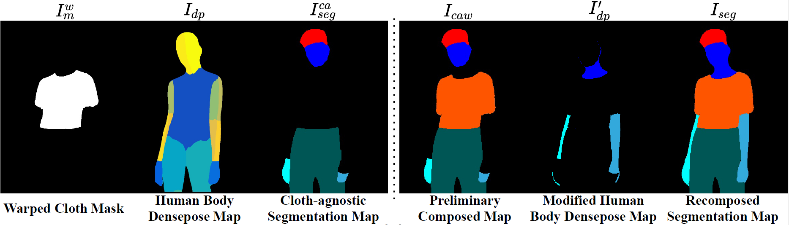
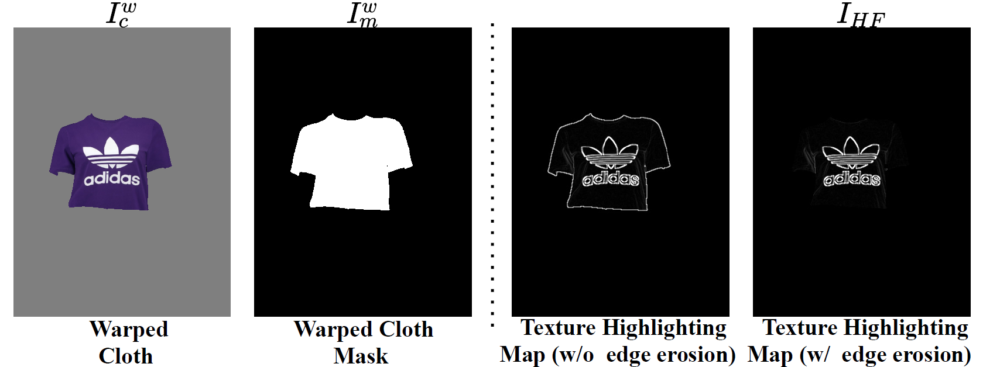

# Segmentation Map
&nbsp;

The code is located in `vitonhd_seg.py`, and the parameters include

```python
## Dataset storage location
parser.add_argument('--dataset_dir', type=str, default='/data/extern/vition-HD')
# The required data includes:"densepose"、"image-parse-agnostic-v3.2"、"warped_mask"
# Among them, warped_mask can be downloaded, with the file name sample and structure as follows:
"sample/{test_paired/test_unpaired/train_paired}/mask"
# Download the warped_mask to the dataset_dir directory
"""
The content that dataset_dir needs to include is as follows:
dataset_dir
|-- sample
|-- train
|-- test
Among them, both train and test contain:
|-- image-parse-agnostic-v3.2
|-- densepose
The sample directory contains:
sample
|-- test_paired
|   `-- mask
|-- test_unpaired
    |   `-- mask
`-- train_paired
    `-- mask
"""

## Splitting dataset txt name
parser.add_argument('--dataset_list', type=str, default='train_pairs_1018new.txt')
# Save the position of the dataset sequence txt for train and test, where the internal content format of txt is: img cloth mode, for example:
"""
12999_00.jpg 12999_00.jpg
"""
# Dataset splitting txt needs to be saved in the dataset_dir directory

## dataset_mode
parser.add_argument('--dataset_mode', type=str, default='test')
## paired
parser.add_argument('--paired', type=str, default='unpaired')
## Save location
parser.add_argument('--save_dir', type=str, default='./results/')
"""
The file structure after saving all file outputs is:
results/
|-- train
|   `-- warped_paired
|-- test
|   `-- warped_paired
|   `-- warped_unpaired
"""
```

The densepose images can be downloaded at: [Baidu Cloud](https://pan.baidu.com/s/13sRu-KVUdUUwwG-FfnSrBQ?pwd=kf0a). The warped mask is generated from the [GP-VTON](https://github.com/xiezhy6/GP-VTON.git). The other data sources is based on the [VITON-HD](https://github.com/shadow2496/VITON-HD) dataset.

Data processing can run the script `vitonhd_seg.sh`, which requires three parameters. The first parameter is **dataset_list**, the second parameter is train/test, and the third parameter is **paid/unpaired**. For example:

```bash
bash vitonhd_seg.sh test_pairs.txt test unpaired
```

Before running the script, it is necessary to modify the path corresponding to the script `vitonhd_seg.sh` to the path of one's own computer based on the local directory.

# Highlighting Map	
&nbsp;

The code is located in `vitonhd_highlight.py`, and the parameters include
```python
## warped clothes dir
parser.add_argument('--warped_path', type=str, default='/home/ock/aigc/GP-VTON-main/sample/viton_hd/train_paired/warped')
## warped masks dir
parser.add_argument('--mask_path', type=str, default='/home/ock/aigc/GP-VTON-main/sample/viton_hd/train_paired/mask')
## output dir
parser.add_argument('--output_folder', type=str, default='/home/ock/aigc/Try-On-old/highlight/train')
```
The warped cloth and mask pair is generated from the [GP-VTON](https://github.com/xiezhy6/GP-VTON.git). Data processing can run the file `vitonhd_highlight.py` . For example:
```
python  data_preparation/vitonhd_highlight.py  --warped_path A --mask_path B --output_folder C
```
